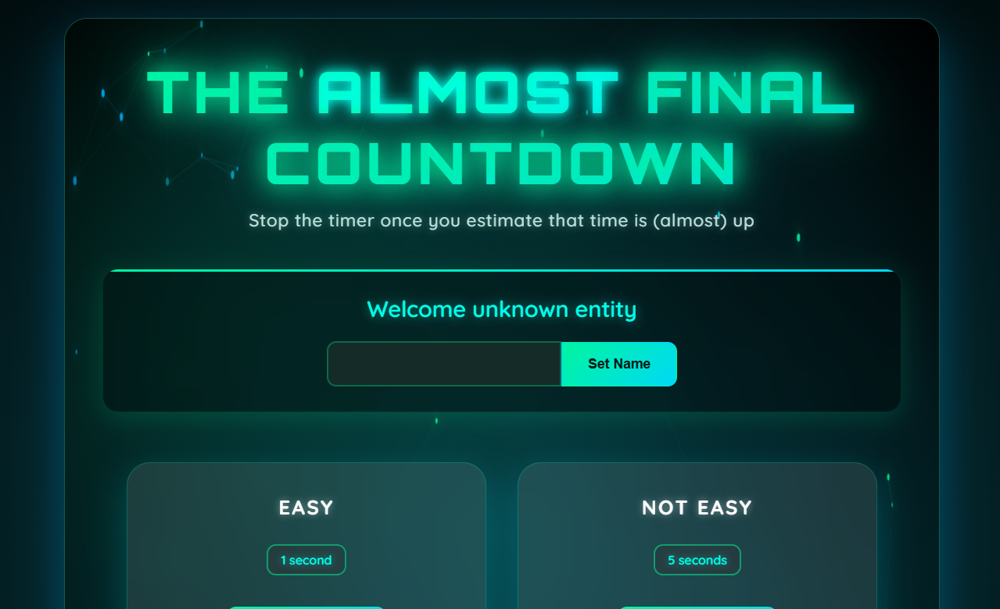
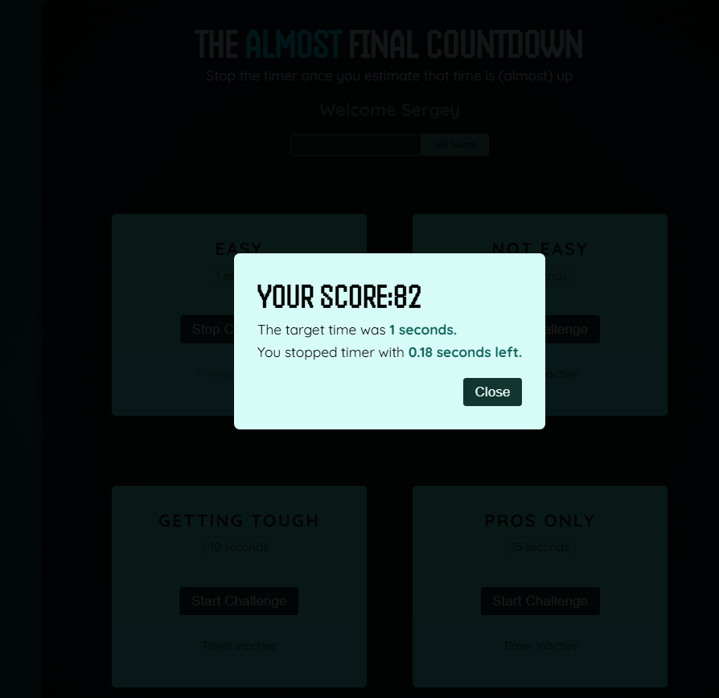
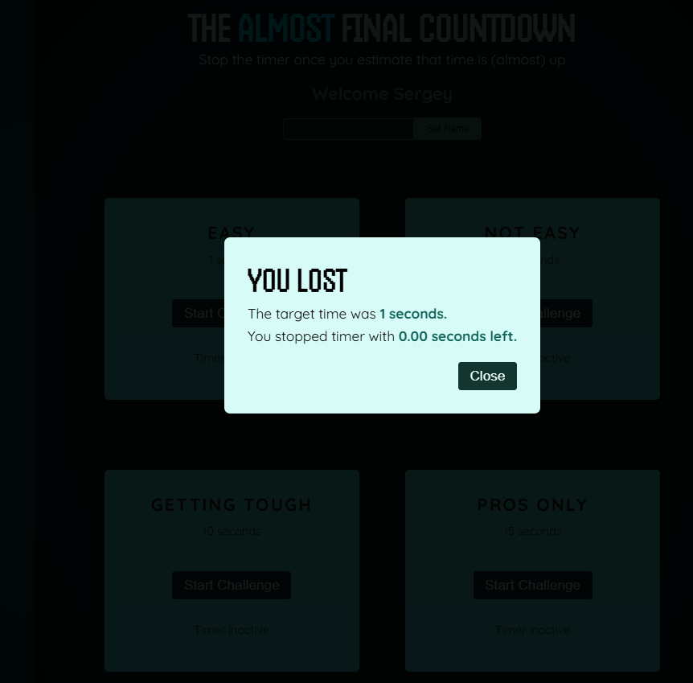

# Time Challenge

This project is an interactive mini-game built with **React**, where users must stop a countdown timer as close to zero as possible.  
It demonstrates the use of **refs**, **imperative component APIs**, and **portals** for rendering modals outside the main DOM hierarchy.

<h3>🎯 Quick Access - Click Below to Visit</h3>

<a href="https://time-challenge-dun.vercel.app/" target="_blank" style="text-decoration: none;">
  

    🌐 Project Overview
  

</a>

<h3 align="center">📸 Project Preview</h3>

   
 

   
  

   
 

---

## Overview

The application consists of several components:
- **Player** — handles user input using `useRef` for uncontrolled form fields.
- **TimerChallenge** — runs the timer logic with `useRef`, `useEffect`, and conditional rendering.
- **ResultModal** — displays results using **React Portals** and exposes an imperative API via `useImperativeHandle`.

## Key Concepts Used

- **useRef()** — for storing mutable values and DOM element references without re-rendering.
- **useImperativeHandle()** — to expose specific methods (`open()`) to parent components.
- **React Portals (createPortal)** — to render modal content directly into the `<body>` or a specific container outside the root DOM node.
- **Conditional rendering** — for showing and hiding modals and timers.
- **setInterval / clearInterval** — for managing time-based events.

## Learning Outcomes

By studying this code, you can learn:
- How to manage DOM elements and timers with React refs.
- How to build modals using React portals.
- How to design components with controlled imperative methods.
- How to integrate state, refs, and side effects to synchronize UI and logic.

